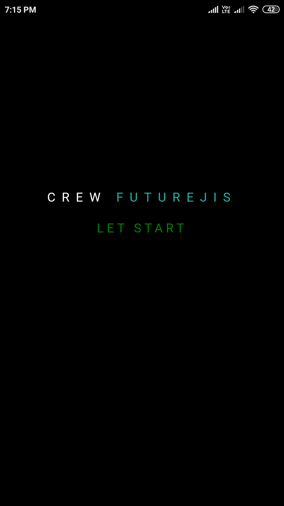

# App

## Summary

- I have tired to create a App. 

- To create a App i have used a Cordova Frameword which is used or provide all the libraries to create a App you can use npm/Node to install this Cordova for further Knowledge please visit to the Cordova Website 

- The languages which i used to create a app is HTML5, CSS3, JAVASCRIPT and PHP(which is used to communicate with local databases)

## Screenshots 

